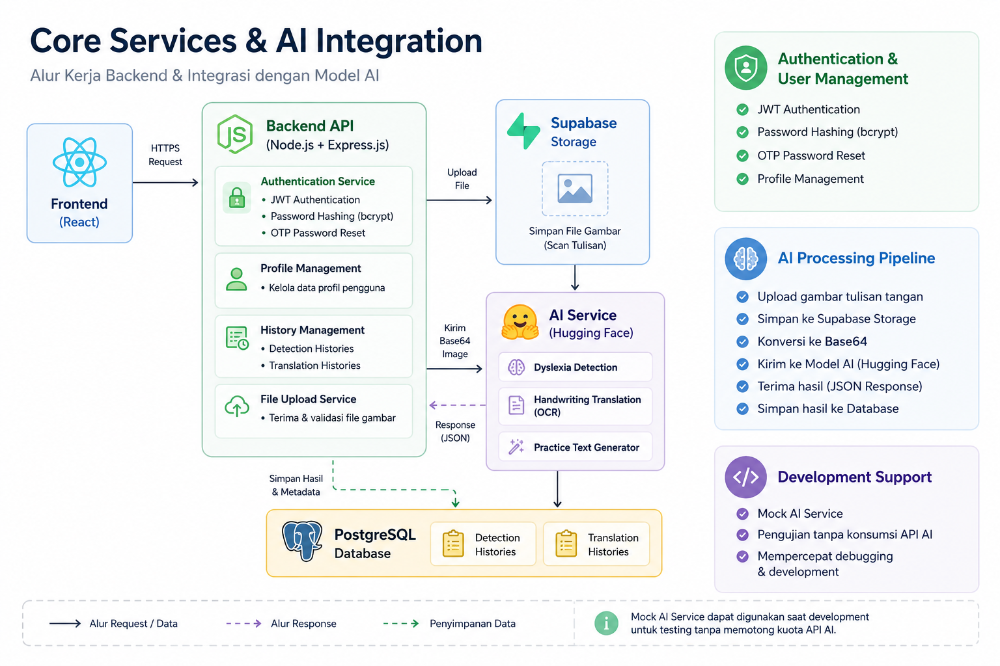
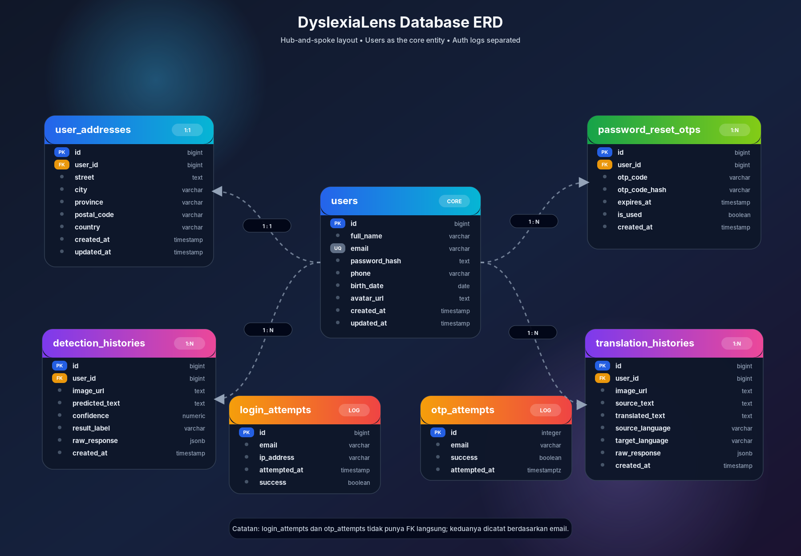

# DyslexiaLens Backend

DyslexiaLens Backend adalah sebuah RESTful API yang dirancang untuk mendukung aplikasi **DyslexiaLens** dalam membantu deteksi pola disleksia dan penerjemahan dokumen tulisan tangan disleksia menjadi teks normal yang mudah dibaca menggunakan teknologi kecerdasan buatan (AI).

Backend ini menyediakan layanan manajemen pengguna (autentikasi dan profil), penyimpanan riwayat analisis secara terintegrasi, manajemen unggah berkas gambar secara aman, serta jembatan penghubung langsung ke model kecerdasan buatan.

---

## Tech Stack Utama

| Kategori | Teknologi | Versi |
| :--- | :--- | :--- |
| **Runtime & Framework** | Node.js (ES Modules) + Express.js | v18+ / 5.2.1 |
| **Database** | PostgreSQL (driver native `pg` pool) | 8.20.0 |
| **Autentikasi** | JSON Web Token (JWT) | 9.0.3 |
| **Password Hashing** | bcrypt | 6.0.0 |
| **File Upload** | multer (penyimpanan lokal) | 2.1.1 |
| **Request Validation** | express-validator | 7.3.2 |
| **Cloud Storage** | Supabase Storage | 2.106.2 |
| **Email/SMTP** | nodemailer | 8.0.10 |
| **API Docs** | Swagger UI + swagger-jsdoc | 5.0.1 / 6.2.8 |
| **Security** | helmet (CSP, CORS), cors | 8.1.0 / 2.8.6 |
| **Logging** | morgan | 1.10.1 |
| **Env Management** | dotenv | 17.4.2 |
| **Dev: Hot Reload** | nodemon | 3.1.14 |
| **Linting** | ESLint (flat config) | 10.4.0 |
| **Testing** | Newman (Postman CLI runner) | 2.1.2 |

---

## Struktur Proyek (Folder Structure)

```
back-end/
├── migrations/                   # Berkas migrasi database SQL (.sql)
├── postman/                      # Postman Collection & Environment JSON
├── src/                          # Kode sumber utama aplikasi
│   ├── app.js                    # Inisialisasi Express & pemasangan middleware
│   ├── server.js                 # Bootstrap server & pengikatan port
│   ├── config/                   # Berkas konfigurasi env & koneksi database
│   │   ├── database.js           # Pengaturan pg pool connection
│   │   ├── env.js                # Pembacaan & validasi variabel lingkungan (.env)
│   │   └── migrate.js            # Mekanisme otomatisasi migrasi database SQL
│   ├── controllers/              # Handler request HTTP (Lapisan Presentation)
│   ├── middlewares/              # Middleware global (auth, upload, error handler)
│   ├── models/                   # Logika query mentah SQL ke PostgreSQL (Lapisan Data)
│   ├── routes/                   # Definisi jalur & routing RESTful API
│   ├── services/                 # Logika bisnis inti aplikasi (Lapisan Service)
│   │   ├── aiService.js          # Titik masuk orkestrasi deteksi & translasi
│   │   ├── authService.js        # Logika registrasi, login, OTP & ubah password
│   │   ├── historyService.js     # Manajemen riwayat per-pengguna
│   │   ├── mockAiService.js      # Mock fallback AI service untuk development lokal
│   │   ├── profileService.js     # Manajemen informasi profil & alamat
│   │   └── realAiService.js      # Layanan integrasi nyata ke model AI disleksia
│   ├── utils/                    # Helper modular & utilitas umum
│   └── validators/               # Chain validator skema input express-validator
├── uploads/                      # Direktori penyimpanan berkas gambar lokal (git-ignored)
├── .env                          # Pengaturan variabel lingkungan aktif (git-ignored)
├── .env.example                  # Contoh acuan penulisan berkas .env
├── .gitignore                    # Berkas pengecualian Git
├── eslint.config.js              # Flat Config konfigurasi ESLint kualitas kode
├── package.json                  # Ketergantungan dependensi proyek & NPM Scripts
├── README.md                     # Dokumentasi panduan umum proyek
└── SETUP.md                      # Panduan mendalam penyiapan lokal & troubleshoot
```

---

## Environment Variables

Berkas `.env` wajib dikonfigurasi sebelum menjalankan aplikasi. Gunakan `.env.example` sebagai template:

```bash
cp .env.example .env
```

### Referensi Variabel Lingkungan

| Variabel | Deskripsi | Default |
| :--- | :--- | :--- |
| `NODE_ENV` | Mode lingkungan aplikasi | `development` |
| `PORT` | Port server backend | `5000` |
| `DATABASE_URL` | URL koneksi PostgreSQL | - |
| `JWT_SECRET` | Rahasia untuk penandatanganan JWT | - |
| `JWT_EXPIRES_IN` | Masa berlaku token JWT | `7d` |
| `OTP_EXPIRES_MINUTES` | Masa berlaku kode OTP (menit) | `10` |
| `MAX_FILE_SIZE_MB` | Ukuran maksimum unggahan gambar (MB) | `5` |
| `FRONTEND_URL` | URL frontend untuk CORS | `http://localhost:5173` |
| `AI_MODEL_BASE_URL` | URL endpoint model AI (Hugging Face) | - |
| `AI_MODEL_API_KEY` | API Key untuk autentikasi model AI | - |
| `AI_MODEL_TIMEOUT_MS` | Timeout request AI (ms) | `30000` |
| `SMTP_HOST` | Host server SMTP | `smtp-relay.brevo.com` |
| `SMTP_PORT` | Port SMTP | `587` |
| `SMTP_USER` | Username SMTP | - |
| `SMTP_PASS` | Password SMTP | - |
| `SMTP_FROM` | Alamat email pengirim | - |
| `SUPABASE_URL` | URL proyek Supabase | - |
| `SUPABASE_KEY` | API Key Supabase (anon/service) | - |
| `SUPABASE_BUCKET` | Nama bucket Supabase Storage | `scan-results` |

---

## Panduan Setup Singkat

Untuk rincian setup yang lebih lengkap, silakan merujuk pada berkas [SETUP.md](file:///d:/Homework/Dicoding/DBS%20Coding%20Camp/Capstone/back-end/SETUP.md).

1. **Unduh Dependensi:**
   ```bash
   npm install
   ```
2. **Duplikasi Konfigurasi:**
   ```bash
   cp .env.example .env
   ```
   *Sesuaikan kredensial PostgreSQL, API Key AI, dan konfigurasi SMTP Mailer Anda di dalam berkas `.env`.*
3. **Jalankan Migrasi Database:**
   ```bash
   npm run migrate
   ```
4. **Jalankan Server dalam Mode Pengembangan:**
   ```bash
   npm run dev
   ```

---

## Integrasi Layanan AI Riil (Real AI Engine)



Aplikasi backend ini telah **sepenuhnya terintegrasi** dengan mesin kecerdasan buatan riil melalui berkas `src/services/realAiService.js`.

### Mekanisme Kerja
1. Pengguna mengunggah gambar tulisan tangan via multipart form-data.
2. Backend membaca gambar tersebut dari sistem penyimpanan lokal (`uploads/`).
3. Gambar diubah menjadi representasi string Base64.
4. Backend mengirimkan request HTTP POST menuju endpoint model AI yang dikonfigurasi melalui variabel lingkungan `AI_MODEL_BASE_URL`, lengkap dengan pengamanan header API Key (`X-API-Key`) menggunakan `AI_MODEL_API_KEY`.

### Endpoint AI yang Digunakan

| Endpoint | Fungsi | Respons Utama |
| :--- | :--- | :--- |
| `POST /api/v1/dyslexia/predict` | Deteksi pola disleksia | `label`, `confidence`, `severityScore`, `severityLevel`, `predictedText` |
| `POST /api/v1/ocr/predict` | Ekstraksi teks tulisan tangan | `sourceText`, `translatedText`, `totalRowsDetected` |
| `POST /api/v1/ai/generate-text` | Generasi kalimat latihan | `sentence`, `wordCount`, `maxLetters`, `language` |

### Fitur Deteksi Disleksia (`analyzeDyslexia`)
Mengembalikan data terstruktur:
- `resultLabel`: Label klasifikasi (contoh: `LIKELY_DYSLEXIA_PATTERN`)
- `confidence`: Probabilitas tingkat keyakinan (0-1)
- `severityScore`: Skor keparahan
- `severityLevel`: Tingkat keparahan
- `predictedText`: Transkrip teks mentah hasil prediksi
- `features`: Fitur tambahan dari model

### Fitur Translasi Korektif (`translateHandwriting`)
Mengembalikan data terstruktur:
- `sourceText`: Pembacaan tulisan tangan OCR
- `translatedText`: Hasil normalisasi teks
- `totalRowsDetected`: Total baris terdeteksi
- `sourceLanguage`: `"handwriting"`
- `targetLanguage`: `"text"`

### Fitur Generasi Teks Latihan (`generatePracticeSentence`)
Mengembalikan data terstruktur:
- `sentence`: Kalimat latihan
- `wordCount`: Jumlah kata
- `maxLetters`: Batas huruf per kata
- `language`: Bahasa
- `modelUsed`: Model yang digunakan

> [!TIP]
> Jika Anda ingin bekerja secara offline atau tanpa koneksi ke server model AI Hugging Face, Anda dapat mengubah kembali import layanan AI di `src/services/aiService.js` untuk mengarah ke `mockAiService.js` yang akan menyimulasikan respons model secara instan.

---

## Struktur Database Skema (PostgreSQL)

Berikut adalah relasi dan kolom dari kelima tabel utama yang diinisialisasi melalui migrasi SQL:




### Catatan Penting Mengenai Skema Alamat (`user_addresses`)
Mengingat frontend saat ini hanya mengirimkan field alamat esensial yaitu `country`, `city`, dan `postalCode`, proses penyimpanan melalui model `upsertUserAddress` akan otomatis memasok nilai string kosong `""` ke kolom `street` dan `province` di database demi kelancaran integritas data tanpa merusak struktur migrasi awal.

### Catatan Mengenai Data AI di `raw_response`
Kolom `raw_response` (JSONB) pada tabel `detection_histories` dan `translation_histories` menyimpan seluruh respons mentah dari model AI, termasuk:
- `severityScore` dan `severityLevel` untuk deteksi disleksia
- `features` (fitur tambahan dari model)
- Data lain yang tidak memiliki kolom khusus di database

---

## Format Respons API

Konsistensi data respons adalah prioritas utama untuk mencegah eror parsing di frontend.

### 1. Respons Sukses Registrasi Akun Baru (201 Created)
```json
{
  "success": true,
  "message": "Register success",
  "data": {
    "id": 12,
    "fullName": "Ahmad Dani",
    "email": "ahmad@gmail.com",
    "createdAt": "2026-06-01T04:47:34.000Z"
  }
}
```

### 2. Respons Sukses Login & Token JWT (200 OK)
```json
{
  "success": true,
  "message": "Login success",
  "data": {
    "accessToken": "eyJhbGciOiJIUzI1NiIsInR5cCI...",
    "user": {
      "id": 12,
      "fullName": "Ahmad Dani",
      "email": "ahmad@gmail.com",
      "createdAt": "2026-06-01T04:47:34.000Z"
    }
  }
}
```

### 3. Respons Gagal Validasi Input (400 Bad Request)
```json
{
  "success": false,
  "message": "Validation error",
  "errors": [
    {
      "type": "field",
      "value": "123",
      "msg": "password min length is 8",
      "path": "password",
      "location": "body"
    }
  ]
}
```

### 4. Respons Deteksi Disleksia (200 OK)
```json
{
  "success": true,
  "message": "Dyslexia analysis completed",
  "data": {
    "id": 1,
    "imageUrl": "https://supabase.co/storage/...",
    "predictedText": "contoh teks",
    "confidence": 0.85,
    "resultLabel": "LIKELY_DYSLEXIA_PATTERN",
    "severityScore": 0.72,
    "severityLevel": "moderate",
    "createdAt": "2026-06-04T10:30:00.000Z"
  }
}
```

### 5. Respons Translasi Tulisan Tangan (200 OK)
```json
{
  "success": true,
  "message": "Handwriting translation completed",
  "data": {
    "id": 1,
    "imageUrl": "https://supabase.co/storage/...",
    "sourceText": "tulisan tangan",
    "translatedText": "tulisan tangan",
    "sourceLanguage": "handwriting",
    "targetLanguage": "text",
    "createdAt": "2026-06-04T10:35:00.000Z"
  }
}
```

---

## Dokumentasi API Interaktif (Swagger UI)

Proyek ini telah dilengkapi dengan dokumentasi API interaktif menggunakan **Swagger UI** (`swagger-ui-express` & `swagger-jsdoc`). Ini memudahkan Anda melihat seluruh daftar endpoint, parameter, skema data, serta menguji API secara langsung dari browser.

### Cara Mengakses Swagger UI
1. Jalankan server lokal dalam mode pengembangan:
   ```bash
   npm run dev
   ```
2. Buka browser Anda dan kunjungi:
   ```http
   http://localhost:5000/api-docs
   ```

### Fitur Utama di Swagger UI:
- **Try it out:** Anda dapat menguji setiap endpoint (termasuk unggah berkas biner di `/uploads` dan pemrosesan AI) langsung dari halaman web Swagger.
- **Bearer Authentication:** Untuk menguji endpoint terproteksi yang membutuhkan autentikasi:
  1. Klik tombol **Authorize** (ikon gembok) di pojok kanan atas.
  2. Masukkan JWT token Anda.
  3. Klik **Authorize**, lalu **Close**.
- **Persist Authorization:** Autentikasi token tetap tersimpan di browser meskipun halaman web di-refresh.
- **Skema & Responses Akurat:** Menampilkan struktur data request body dan respons sukses/error untuk setiap rute sesuai dengan `API_CONTRACT.md`.

---

## Pengujian Berbasis Postman & Newman

Seluruh endpoint backend telah tercover oleh automated test suite yang tersimpan di dalam folder `postman/`.

- **Collection File:** `postman/DyslexiaLens-Backend.postman_collection.json`
- **Environment File:** `postman/DyslexiaLens-Local.postman_environment.json`

### Cara Menjalankan Tes Secara Otomatis
Anda dapat menggunakan Newman CLI untuk mengeksekusi tes langsung melalui terminal:

```bash
# Pastikan newman terpasang secara global
npm install -g newman

# Jalankan suite pengujian
newman run postman/DyslexiaLens-Backend.postman_collection.json -e postman/DyslexiaLens-Local.postman_environment.json
```

> [!NOTE]
> Koleksi uji diatur dalam folder berurutan dari atas ke bawah: `System` -> `Auth` -> `Profile` -> `AI` -> `History` -> `Negative Tests`. Pastikan untuk mengimpor berkas environment lokal agar parameter token JWT dan OTP dapat di-chain secara otomatis antar request.

---

## Fitur Keamanan

Backend ini dilengkapi dengan berbagai fitur keamanan:

| Fitur | Deskripsi |
| :--- | :--- |
| **Helmet** | Mengamankan HTTP headers (CSP, XSS protection, dll) |
| **CORS** | Whitelist domain frontend yang diizinkan |
| **JWT Authentication** | Token-based stateless authentication |
| **Password Hashing** | bcrypt dengan salt rounds untuk keamanan password |
| **File Upload Validation** | Validasi MIME type (image/*) dan ukuran maksimum (5MB) |
| **Parameterized Queries** | Pencegahan SQL injection melalui parameterized queries |
| **Request Validation** | Validasi input menggunakan express-validator |
| **Rate Limiting** | *Belum diterapkan* - direkomendasi untuk produksi |

---

## Deployment

### Vercel (Serverless)

Backend dikonfigurasi untuk deployment sebagai Vercel Serverless Function:

- **Entry Point:** `api/index.js`
- **Max Duration:** 10 detik
- **Rewrite Rules:** Semua route diarahkan ke serverless function

Konfigurasi `vercel.json`:
```json
{
  "version": 2,
  "builds": [
    {
      "src": "api/index.js",
      "use": "@vercel/node"
    }
  ],
  "routes": [
    {
      "src": "/(.*)",
      "dest": "api/index.js"
    }
  ]
}
```

### Standalone Server

Untuk deployment traditional (VPS, Docker, dll):
```bash
npm install
npm run migrate
npm start
```

> [!NOTE]
> Server akan otomatis melewati `app.listen()` jika environment variable `VERCEL` terdeteksi.

---

## NPM Scripts Reference

Berikut adalah perintah singkat yang dapat Anda jalankan menggunakan npm:

| Script | Deskripsi |
| :--- | :--- |
| `npm run dev` | Memulai server lokal dengan hot-reload menggunakan `nodemon` |
| `npm run start` | Menjalankan server aplikasi pada mode produksi |
| `npm run migrate` | Mengeksekusi migrasi tabel dan indeks SQL ke PostgreSQL |
| `npm run test` | Menjalankan suite pengujian Postman menggunakan Newman |
| `npm run test:json` | Menjalankan pengujian dengan output JSON |
| `npm run smoke:ocr` | Menjalankan smoke test untuk endpoint OCR |
| `npm run lint` | Melakukan pemindaian kualitas kode menggunakan ESLint |
| `npm run lint:fix` | Menganalisis sekaligus memperbaiki error/warning ESLint secara otomatis |

---

## Checklist Progres Akhir Backend

Berikut adalah status penyelesaian fitur dan kesiapan backend DyslexiaLens:

### 🔑 Autentikasi & Pengguna
- [x] Registrasi Akun Baru (`POST /api/v1/auth/register`)
- [x] Login & Penyerahan JWT (`POST /api/v1/auth/login`)
- [x] Lupa Kata Sandi via OTP Email (`POST /api/v1/auth/forgot-password`)
- [x] Verifikasi OTP (`POST /api/v1/auth/verify-otp`)
- [x] Reset & Ubah Kata Sandi (`POST /api/v1/auth/reset-password` / `PATCH /api/v1/auth/change-password`)
- [x] Get & Update Profil & Alamat (`GET /api/v1/profile` / `PATCH /api/v1/profile`)

### 🧠 Integrasi Layanan AI
- [x] Pengiriman gambar multipart form-data & konversi Base64
- [x] Integrasi model deteksi disleksia (`POST /api/v1/dyslexia/predict` via Hugging Face)
- [x] Integrasi model OCR tulisan tangan (`POST /api/v1/ocr/predict` via Hugging Face)
- [x] Integrasi model text generator latihan (`POST /api/v1/ai/generate-text`)
- [x] Implementasi **Mock AI Service** untuk fallback pengembangan lokal offline

### 📂 Penyimpanan & Riwayat
- [x] Integrasi **Supabase Storage** untuk unggah berkas gambar secara cloud
- [x] Penyimpanan riwayat deteksi & translasi ke PostgreSQL
- [x] Penyimpanan fleksibel metadata model AI menggunakan tipe data **JSONB** (`raw_response`)
- [x] Pengambilan riwayat per pengguna (`GET /api/v1/history`)
- [x] Penghapusan riwayat tertentu (`DELETE /api/v1/history/:id`)

### 🛡️ Keamanan & Kualitas Kode
- [x] HTTP headers protection (`helmet`)
- [x] Pembatasan CORS domain frontend
- [x] Proteksi SQL Injection (parameterized queries)
- [x] Pembatasan file upload (multer validation MIME & size 5MB)
- [x] Pemindaian & standardisasi kode dengan **ESLint**

### 🧪 Dokumentasi & Pengujian
- [x] Dokumentasi API interaktif dengan **Swagger UI** (`/api-docs`)
- [x] Automated testing menggunakan **Postman & Newman CLI** (100% test case lulus)
- [x] Konfigurasi serverless deployment untuk **Vercel** (`vercel.json`)

---

**Version:** DyslexiaLens Backend v1.2.0  
**Last Updated:** June 7, 2026
