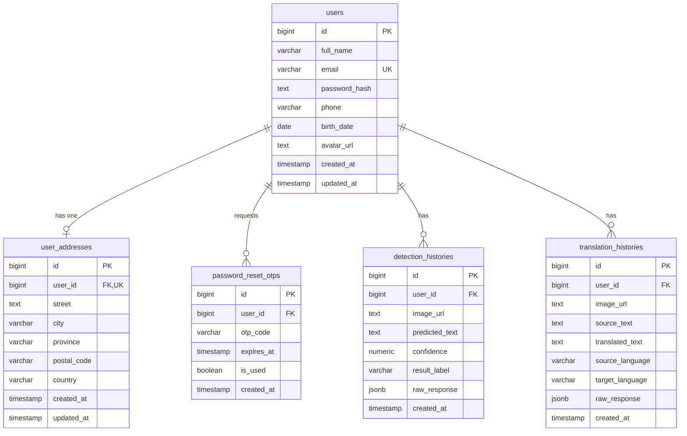

# DyslexiaLens Backend

DyslexiaLens Backend adalah sebuah RESTful API yang dirancang untuk mendukung aplikasi **DyslexiaLens** dalam membantu deteksi pola disleksia dan penerjemahan dokumen tulisan tangan disleksia menjadi teks normal yang mudah dibaca menggunakan teknologi kecerdasan buatan (AI).

Backend ini menyediakan layanan manajemen pengguna (autentikasi dan profil), penyimpanan riwayat analisis secara terintegrasi, manajemen unggah berkas gambar secara aman, serta jembatan penghubung langsung ke model kecerdasan buatan.

---

## Tech Stack Utama

- **Runtime & Framework:** Node.js (ES Modules) + Express.js
- **Database:** PostgreSQL (menggunakan driver native `pg` pool)
- **Autentikasi:** JSON Web Token (JWT) via `jsonwebtoken`
- **Keamanan Kredensial:** Password Hashing via `bcrypt`
- **Unggah Gambar:** `multer` (penyimpanan lokal di `/uploads` dengan validasi ukuran dan MIME type)
- **Validasi Data:** Robust Request Validation via `express-validator`
- **Environment Management:** `dotenv`
- **Pemeriksa Kualitas Kode:** `eslint` (Flat configuration)
- **Testing:** Postman Collection + Newman CLI

---

## Struktur Proyek (Folder Structure)

```
back-end/
├── migrations/                   # Berkas migrasi database SQL (.sql)
├── postman/                      # Postman Collection & Environment JSON
├── src/                          # Kode sumber utama aplikasi
│   ├── app.js                    # Inisialisasi Express & pemasangan middleware
│   ├── server.js                 # Bootstrap server & pengikatan port
│   ├── config/                   # Berkas konfigurasi env & koneksi database
│   │   ├── database.js           # Pengaturan pg pool connection
│   │   ├── env.js                # Pembacaan & validasi variabel lingkungan (.env)
│   │   └── migrate.js            # Mekanisme otomatisasi migrasi database SQL
│   ├── controllers/              # Handler request HTTP (Lapisan Presentation)
│   ├── middlewares/              # Middleware global (auth, upload, error handler)
│   ├── models/                   # Logika query mentah SQL ke PostgreSQL (Lapisan Data)
│   ├── routes/                   # Definisi jalur & routing RESTful API
│   ├── services/                 # Logika bisnis inti aplikasi (Lapisan Service)
│   │   ├── aiService.js          # Titik masuk orkestrasi deteksi & translasi
│   │   ├── authService.js        # Logika registrasi, login, OTP & ubah password
│   │   ├── historyService.js     # Manajemen riwayat per-pengguna
│   │   ├── mockAiService.js      # Mock fallback AI service untuk development lokal
│   │   ├── profileService.js     # Manajemen informasi profil & alamat
│   │   └── realAiService.js      # Layanan integrasi nyata ke model AI disleksia
│   ├── utils/                    # Helper modular & utilitas umum
│   └── validators/               # Chain validator skema input express-validator
├── uploads/                      # Direktori penyimpanan berkas gambar lokal (git-ignored)
├── .env                          # Pengaturan variabel lingkungan aktif (git-ignored)
├── .env.example                  # Contoh acuan penulisan berkas .env
├── .gitignore                    # Berkas pengecualian Git
├── eslint.config.js              # Flat Config konfigurasi ESLint kualitas kode
├── package.json                  # Ketergantungan dependensi proyek & NPM Scripts
├── README.md                     # Dokumentasi panduan umum proyek
└── SETUP.md                      # Panduan mendalam penyiapan lokal & troubleshoot
```

---

## Panduan Setup Singkat

Untuk rincian setup yang lebih lengkap, silakan merujuk pada berkas [SETUP.md](file:///d:/Homework/Dicoding/DBS%20Coding%20Camp/Capstone/back-end/SETUP.md).

1. **Unduh Dependensi:**
   ```bash
   npm install
   ```
2. **Duplikasi Konfigurasi:**
   ```bash
   cp .env.example .env
   ```
   *Sesuaikan kredensial PostgreSQL dan konfigurasi SMTP Mailer Anda di dalam berkas `.env`.*
3. **Jalankan Migrasi Database:**
   ```bash
   npm run migrate
   ```
4. **Jalankan Server dalam Mode Pengembangan:**
   ```bash
   npm run dev
   ```

---

## Integrasi Layanan AI Riil (Real AI Engine)

Aplikasi backend ini telah **sepenuhnya terintegrasi** dengan mesin kecerdasan buatan riil melalui berkas `src/services/realAiService.js`.

### Mekanisme Kerja
1. Pengguna mengunggah gambar tulisan tangan via multipart form-data.
2. Backend membaca gambar tersebut dari sistem penyimpanan lokal (`uploads/`).
3. Gambar diubah menjadi representasi string Base64.
4. Backend mengirimkan request HTTP POST menuju endpoint `https://dyslexialens-dyslexialens-dicoding-ai.hf.space/api/v1/dyslexia/predict` untuk deteksi disleksia, `/api/v1/ocr/predict` untuk ekstraksi teks, dan `/api/v1/ai/generate-text` untuk pembuatan teks latihan pada server model AI yang ditentukan melalui variabel lingkungan `AI_MODEL_BASE_URL`, lengkap dengan pengamanan header API Key (`X-API-Key`) menggunakan `AI_MODEL_API_KEY`.
5. Respons hasil dari model AI dipetakan secara terstruktur:
   - **Fitur Deteksi Disleksia (`analyzeDyslexia`):** Mengembalikan label klasifikasi (`resultLabel`, seperti `LIKELY_DYSLEXIA_PATTERN`), probabilitas tingkat keyakinan (`confidence`), skor keparahan (`severityScore`), tingkat keparahan (`severityLevel`), beserta transkrip teks mentah hasil prediksi (`predictedText`).
  - **Fitur Translasi Korektif (`translateHandwriting`):** Mengembalikan pembacaan tulisan tangan OCR (`sourceText`), hasil normalisasi teks (`translatedText`), total baris terdeteksi (`totalRowsDetected`), serta penanda bahasa (`sourceLanguage: "handwriting"`, `targetLanguage: "text"`).
  - **Fitur Generasi Teks Latihan (`generatePracticeSentence`):** Mengembalikan kalimat latihan (`sentence`), jumlah kata, batas huruf per kata, bahasa, dan model yang dipakai.
6. Hasil tersebut otomatis tersimpan ke dalam database PostgreSQL sebagai rekaman riwayat terenskripsi JSONB dan dikembalikan ke pengguna.

> [!TIP]
> Jika Anda ingin bekerja secara offline atau tanpa koneksi ke server model AI Hugging Face, Anda dapat mengubah kembali import layanan AI di `src/services/aiService.js` untuk mengarah ke `mockAiService.js` yang akan menyimulasikan respons model secara instan.

---

## Struktur Database Skema (PostgreSQL)

Berikut adalah relasi dan kolom dari kelima tabel utama yang diinisialisasi melalui migrasi SQL:



### Catatan Penting Mengenai Skema Alamat (`user_addresses`)
Mengingat frontend saat ini hanya mengirimkan field alamat esensial yaitu `country`, `city`, dan `postalCode`, proses penyimpanan melalui model `upsertUserAddress` akan otomatis memasok nilai string kosong `""` ke kolom `street` dan `province` di database demi kelancaran integritas data tanpa merusak struktur migrasi awal.

---

## Format Respons API

Konsistensi data respons adalah prioritas utama untuk mencegah eror parsing di frontend.

### 1. Respons Sukses Registrasi Akun Baru (201 Created)
```json
{
  "success": true,
  "message": "Register success",
  "data": {
    "id": 12,
    "fullName": "Ahmad Dani",
    "email": "ahmad@gmail.com",
    "createdAt": "2026-06-01T04:47:34.000Z"
  }
}
```

### 2. Respons Sukses Login & Token JWT (200 OK)
```json
{
  "success": true,
  "message": "Login success",
  "data": {
    "accessToken": "eyJhbGciOiJIUzI1NiIsInR5cCI...",
    "user": {
      "id": 12,
      "fullName": "Ahmad Dani",
      "email": "ahmad@gmail.com",
      "createdAt": "2026-06-01T04:47:34.000Z"
    }
  }
}
```

### 3. Respons Gagal Validasi Input (400 Bad Request)
```json
{
  "success": false,
  "message": "Validation error",
  "errors": [
    {
      "type": "field",
      "value": "123",
      "msg": "password min length is 8",
      "path": "password",
      "location": "body"
    }
  ]
}
```

---

## Dokumentasi API Interaktif (Swagger UI)

Proyek ini telah dilengkapi dengan dokumentasi API interaktif menggunakan **Swagger UI** (`swagger-ui-express` & `swagger-jsdoc`). Ini memudahkan Anda melihat seluruh daftar endpoint, parameter, skema data, serta menguji API secara langsung dari browser.

### Cara Mengakses Swagger UI
1. Jalankan server lokal dalam mode pengembangan:
   ```bash
   npm run dev
   ```
2. Buka browser Anda dan kunjungi:
   ```http
   http://localhost:5000/api-docs
   ```

### Fitur Utama di Swagger UI:
- **Try it out:** Anda dapat menguji setiap endpoint (termasuk unggah berkas biner di `/uploads` dan pemrosesan AI) langsung dari halaman web Swagger.
- **Bearer Authentication:** Untuk menguji endpoint terproteksi yang membutuhkan autentikasi:
  1. Klik tombol **Authorize** (ikon gembok) di pojok kanan atas.
  2. Masukkan JWT token Anda.
  3. Klik **Authorize**, lalu **Close**.
- **Persist Authorization:** Autentikasi token tetap tersimpan di browser meskipun halaman web di-refresh.
- **Skema & Responses Akurat:** Menampilkan struktur data request body dan respons sukses/error untuk setiap rute sesuai dengan `API_CONTRACT.md`.

---

## Pengujian Berbasis Postman & Newman

Seluruh endpoint backend telah tercover oleh automated test suite yang tersimpan di dalam folder `postman/`.

- **Collection File:** `postman/DyslexiaLens-Backend.postman_collection.json`
- **Environment File:** `postman/DyslexiaLens-Local.postman_environment.json`

### Cara Menjalankan Tes Secara Otomatis
Anda dapat menggunakan Newman CLI untuk mengeksekusi tes langsung melalui terminal:

```bash
# Pastikan newman terpasang secara global
npm install -g newman

# Jalankan suite pengujian
newman run postman/DyslexiaLens-Backend.postman_collection.json -e postman/DyslexiaLens-Local.postman_environment.json
```

> [!NOTE]
> Koleksi uji diatur dalam folder berurutan dari atas ke bawah: `System` -> `Auth` -> `Profile` -> `AI` -> `History` -> `Negative Tests`. Pastikan untuk mengimpor berkas environment lokal agar parameter token JWT dan OTP dapat di-chain secara otomatis antar request.

---

## NPM Scripts Reference

Berikut adalah perintah singkat yang dapat Anda jalankan menggunakan npm:

- `npm run dev` : Memulai server lokal dengan hot-reload memanfaatkan `nodemon`.
- `npm run start` : Menjalankan server aplikasi pada mode produksi.
- `npm run migrate` : Mengeksekusi migrasi tabel dan indeks SQL ke PostgreSQL.
- `npm run lint` : Melakukan pemindaian kualitas kode menggunakan ESLint.
- `npm run lint:fix` : Menganalisis sekaligus memperbaiki error/warning ESLint secara otomatis.

---

**Version:** DyslexiaLens Backend v1.1.0  
**Last Updated:** June 1, 2026
